# Transitions from Writing to Dictating: A Stylometric Analysis

## Overview
This repository contains the analysis and findings of a stylometric study investigating how the physical act of composition governs authorial voice. Specifically, it traces the stylistic evolution of eight major authors whose physical or visual ailments forced them to transition from traditional manuscript writing to spoken dictation.

The study categorizes texts into three phases: **Early** (manuscript/sighted), **Middle** (transitional/procedural instability), and **Late** (dictated/visually impaired). 

## Study Cohorts
* **Cohort 1: Sighted / Physical Limitations**
  * *Authors:* Henry James, Joseph Conrad, Sir Walter Scott, Robert Louis Stevenson.
  * *Context:* Transitioned due to severe physical ailments, often involving mechanical variables (typewriters) or amanuensis interference.
* **Cohort 2: Visually Impaired**
  * *Authors:* Aldous Huxley, Booth Tarkington, Wilkie Collins, Lafcadio Hearn.
  * *Context:* Transitioned due to progressive vision loss. This cohort lost the crucial visual feedback loop of the physical page, forcing reliance on working memory.

---

## Key Findings

### 1. Stylometric Drift (KL Divergence & Cross-Entropy)
Losing visual feedback creates a significantly larger departure from an author's stylistic baseline than simply changing the physical tool of writing. 

Stylometric drift was quantified using Kullback-Leibler (KL) divergence, comparing the pooled early baseline ($P$) against target texts ($Q$):

$$D_{KL}(P || Q) = \sum_{w \in V} P(w) \log_2 \left( \frac{P(w)}{Q(w)} \right)$$

* **Sighted Authors:** Exhibited a controlled, "stair-step" stylistic drift. KL divergence hovered near **2**.
* **Visually Impaired Authors:** Displayed a profound stylistic gulf. KL divergence frequently exceeded **4** (and surpassed **6** for Lafcadio Hearn), underscoring a drastic evolution in syntax and vocabulary.

**Cohort 1: Sighted / Physical Limitations**
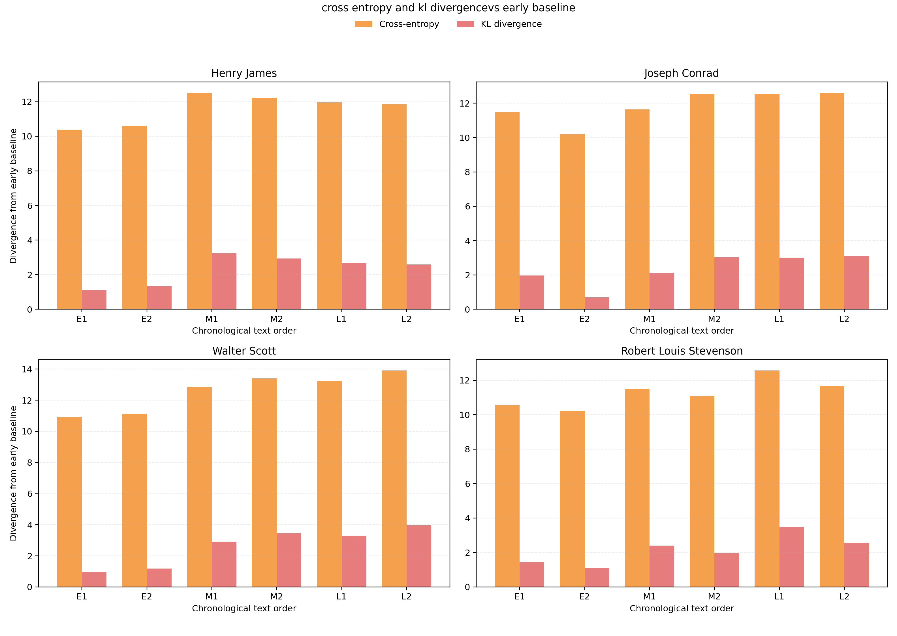

**Cohort 2: Visually Impaired**
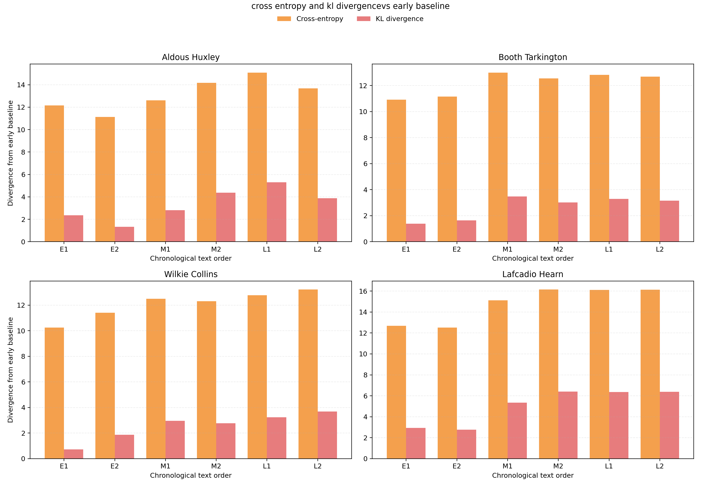

### 2. Working Memory Limits (Mean Dependency Distance)
Mean dependency distance (the distance between a dependent word and its head) acted as a direct visualizer of an author's working memory capacity.
* **Sighted Authors:** Demonstrated no unified trend. Authors like James and Scott actually *increased* their dependency distances, leveraging the pacing of dictation to craft more expansive, conversational prose.
* **Visually Impaired Authors:** Showed unified, downward trends. Without a visual anchor, these authors avoided syntactic collapse by keeping dependent words physically closer to their heads and flattening their overall clause trees.

**Cohort 1: Sighted / Physical Limitations**
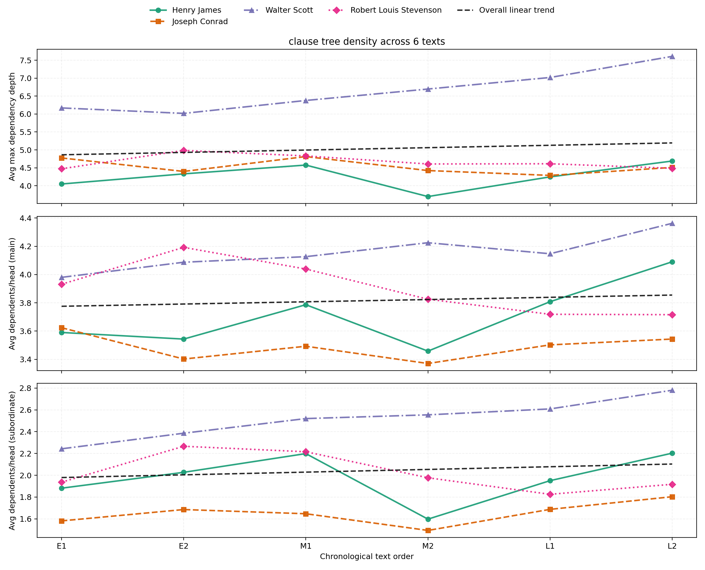

**Cohort 2: Visually Impaired**
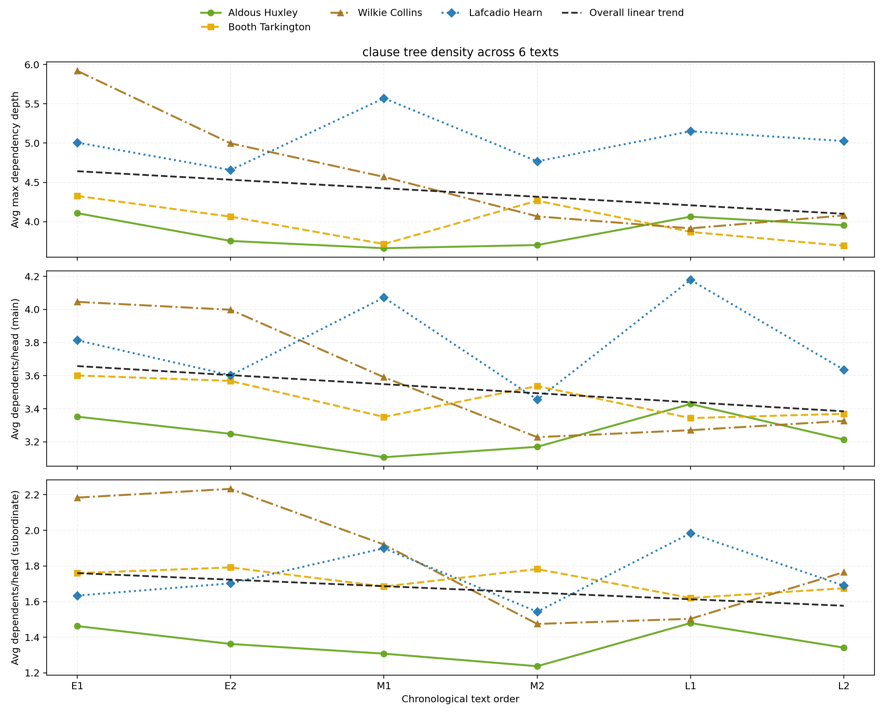

### 3. Sentence Length and Clause Complexity
Across the entire sample, the data indicates a general shift toward shorter, less complex sentences between the early and late phases. Scatter plots mapping sentence length against syntactic complexity illustrate how specific methodological limitations influenced output:
* **Sighted Authors (Physical Limitations):** This group shows a measurable correlation between reduced physical stamina and truncated syntactic output. Authors managing severe physical illness or heavy medical interventions (such as Stevenson and Collins) exhibit a marked reduction in both average sentence length and overall clause complexity compared to their early manuscript baselines. 
* **Visually Impaired Authors:** This cohort demonstrates a uniform downward trajectory in complexity, with data clusters shifting tightly downward as vision loss progressed. Furthermore, structural constraints introduced during the transitional phase significantly impacted final metrics. For example, Tarkington's transitional use of oversized paper and thick writing tools imposed hard physical limits on sentence length—a syntactical constraint that the data shows persisted even after he fully transitioned to blind dictation.

**Cohort 1: Sighted / Physical Limitations**
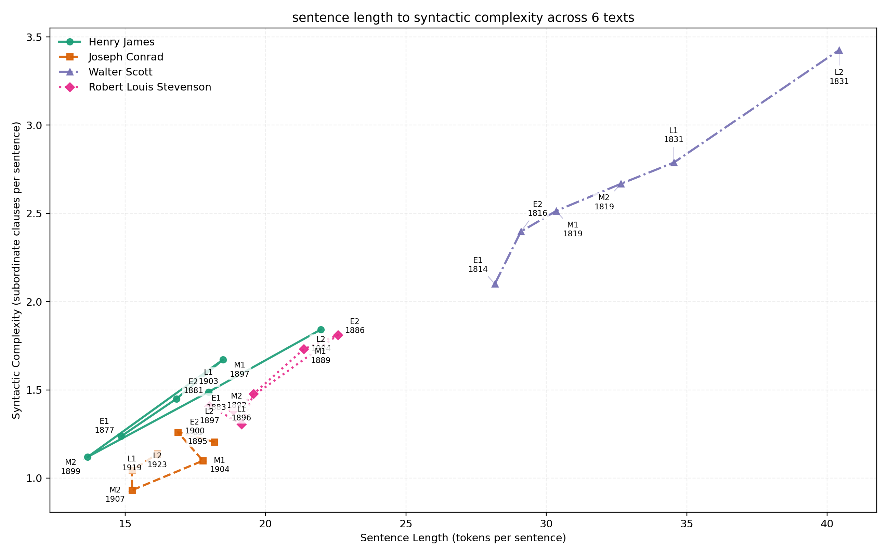

**Cohort 2: Visually Impaired**
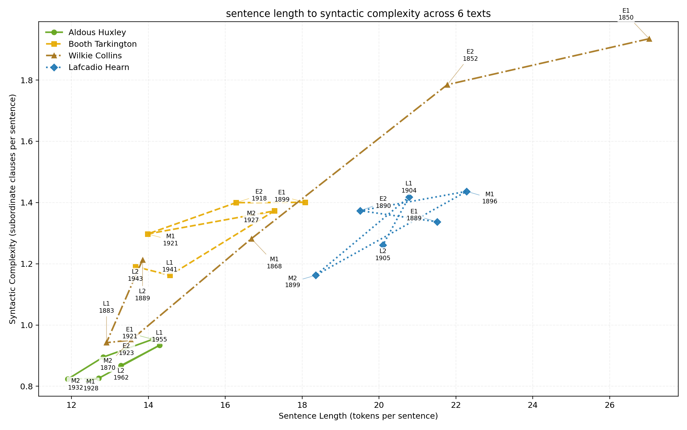

**Individual Author Detail**

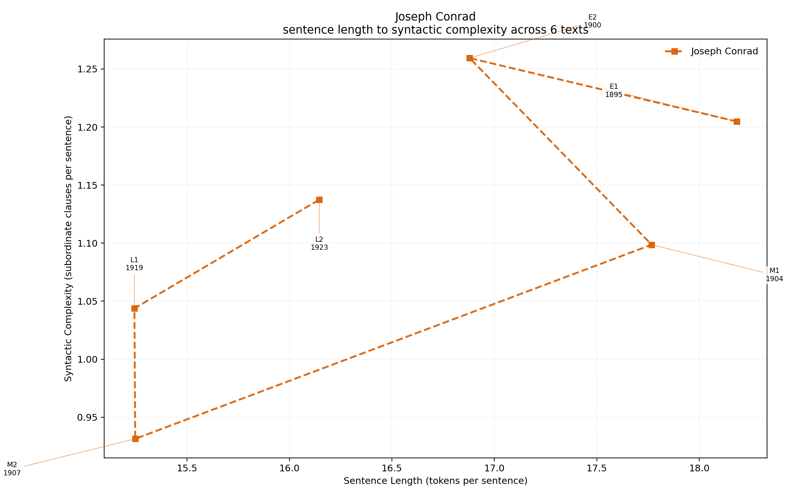
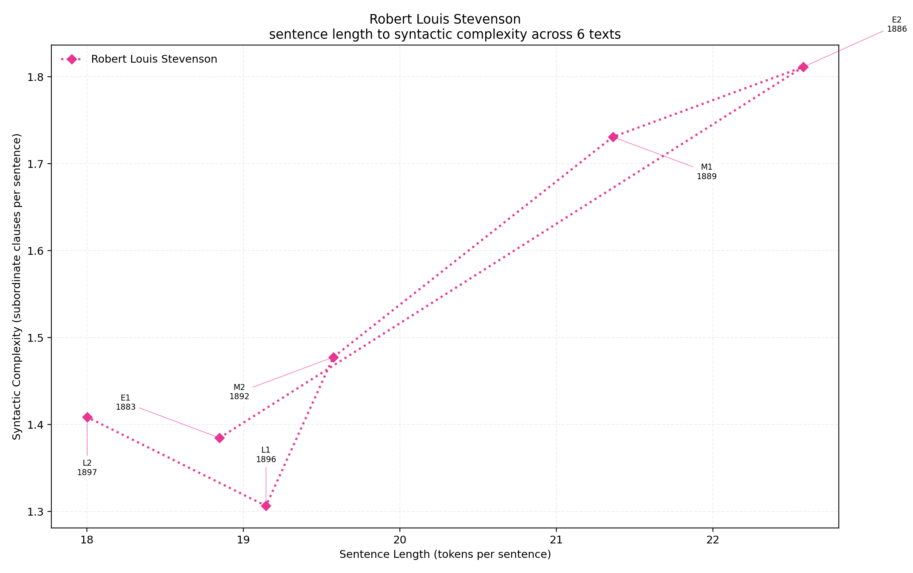
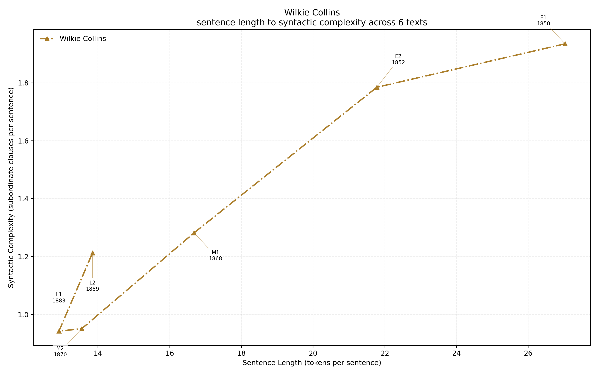
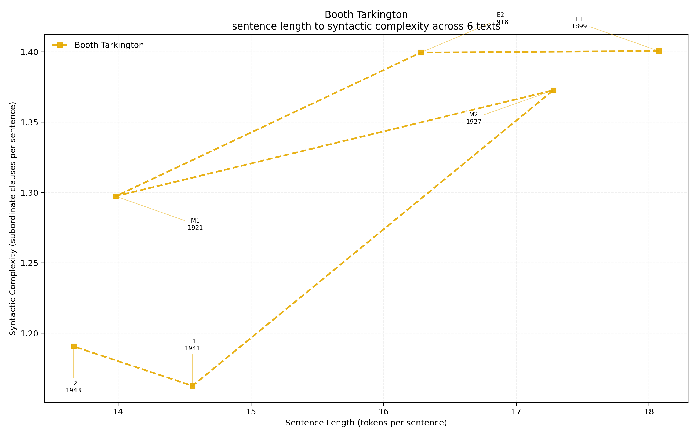

### 4. Clause Linkage (Parataxis vs. Hypotaxis)
While almost all authors maintained a baseline of hypotactic dominance (subordination of dependent clauses), the transition to dictation split the cohorts entirely:
* **Sighted Authors:** Increased their use of hypotaxis. Conrad and Scott showed near-linear progressions toward heavier hypotactic subordination in their late periods.
* **Visually Impaired Authors:** Systematically compressed their syntax. Bound by the strict limits of working memory without a visible manuscript, they relied far less on complex subordination.

**Cohort 1: Sighted / Physical Limitations**
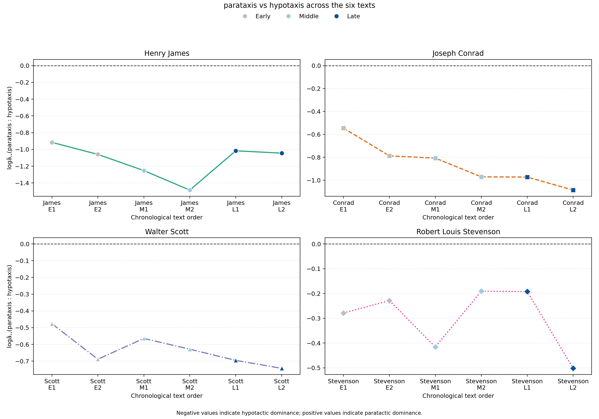

**Cohort 2: Visually Impaired**
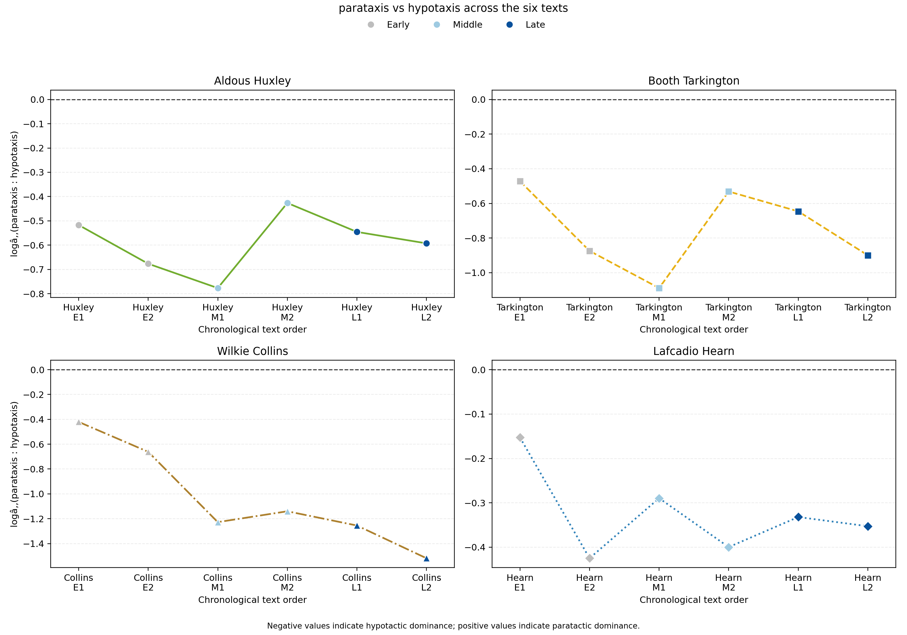

---

## Conclusion
The shift to spoken-word composition leaves a highly specific, quantifiable imprint on an author's syntax, dictated by their biological reality. Sighted authors often used the safety net of visual review to push deeper into complex hypotaxis. Conversely, visually impaired authors—fighting immense mechanical friction and working memory limits—systematically compressed their syntax, resulting in a much higher magnitude of divergence from their original handwritten styles.
